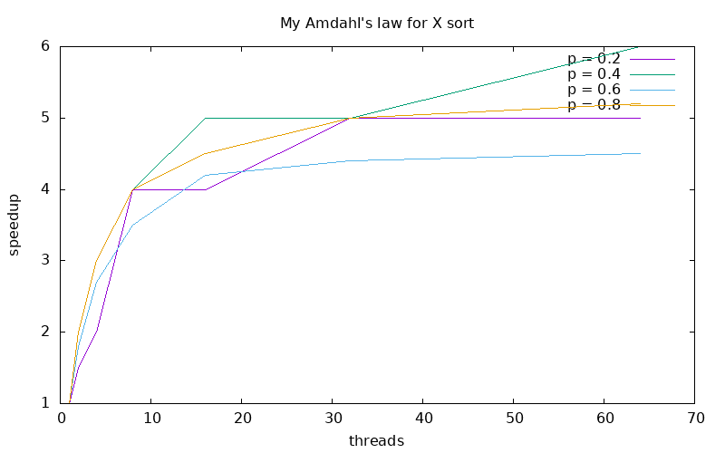
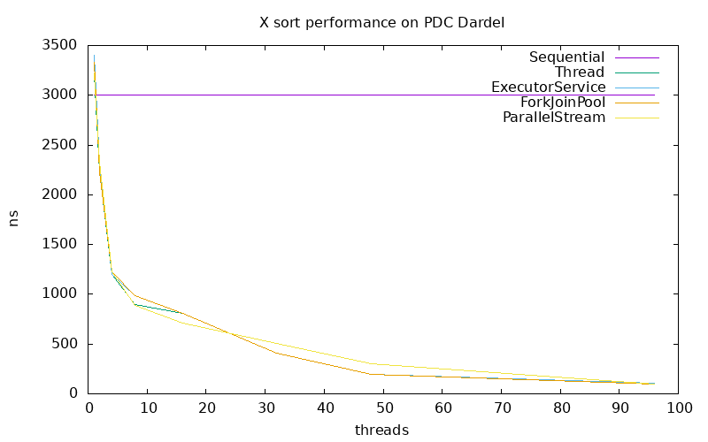

# Lab 2 - Java Parallel Programming and Sorting Algorithms
- Group X
- Lastname, Firstname and Lastname, Firstname

## Task 1: Sequential Sort
We chose to implement MergeSort/QuickSort ...

Source files:

- `SequentialSort.java`

## Task 2: Amdahl's Law

Our Amdahl's law ...

Here is a plot of our version of Amdahl's law ...

We see that ...

## Task 3: ExecutorServiceSort

Source files:

- `ExecutorServiceSort.java`

We decided to ...

## Task 4: ForkJoinPoolSort

Source files:

- `ForkJoinPoolSort.java`

We decided to ...

## Task 5: ParallelStreamSort

Source files:

- `ForkJoinPoolSort.java`

We decided to ...

## Task 6: Performance measurements with PDC

We decided to sort 10,000,000 integers ...

We see that ...
