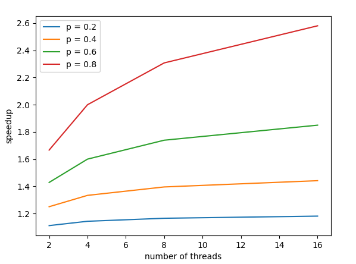

# Lab 2 - Java Parallel Programming and Sorting Algorithms
- Group X
- Lastname, Firstname and Lastname, Firstname

## Task 1: Sequential Sort
We chose to implement MergeSort/QuickSort ...

Source files:

- `SequentialSort.java`

## Task 2: Amdahl's Law

### Limitations of regular Amdahl's law in our case

Quicksort algorithm recursively divide sorting problem into two subproblems, by cutting initial array into two subarrays.
Considering the binary tree of all subarrays, that means at most $2^k$ threads can execute at the same time in depth $k$.

Depth 0 corresponds to the first `partition()` call and is our sequential part $s$.

Depth 1 and below form our parallelizable part. But even with $n > 2$ threads, depth 1 speedup will be only 2 as only 2 threads can work on that part simultaneously.

Similarly, depth $k$ speedup can be at most $2^k$ as at most $2^k$ threads can work on it simultaneously. That means we cannot consider as regular Amdahl's law does that the whole parallelizable part is executed in parralel by our $n$ threads.

### Our version of Amdahl's law for 2, 4, 8, 16 threads

With $n = 2$ threads, as the whole parallelizable part can be executed with 2 threads, our speedup is the same as the regular Amdahl's law :

$$
S_2 = \frac1{1 - p + \frac{p}{2}} = \frac1{1-\frac{p}2}
$$

With $n = 4$ threads, depth 1 speedup will be 2, and depth 2 and below speedup will be 4. The fraction of time spent to compute depth 1 depends on the sorted array size, so we will estimate it to $\frac{p}2$, which corresponds to the worst case in term of speedup (array of size 4). Then our speedup is :

$$
S_4 = \frac1{1-p + \frac{\frac{p}2}{2} + \frac{\frac{p}2}{4}} = \frac1{1 - \frac58p}
$$

Similarly, with $n=8$, we estimate the fraction of time spent to compute depth 1 to $\frac{p}3$, depth 2 to $\frac{p}3$, and depths 3 and below to $\frac{p}3$. Our speedup is :

$$
S_8 = \frac1{1-p + \frac{p / 3}2 + \frac{p / 3}4 + \frac{p / 3}8} = \frac1{1 - \frac{17}{24}p}
$$

Finally, with $n = 16$, our speedup is :

$$
S_{16} = \frac1{1-p + \frac{p / 4}2 + \frac{p / 4}4 + \frac{p / 4}8 + \frac{p / 4}{16}} = \frac1{1 - \frac{49}{64}p}
$$

### Plots

Here is a plot of our version of our Amdahl's law

We see that even with a high parallelizable part, speedup doesn't scale that much as $n$ increase, due to the first depths that have to be executed by a few amount of threads.

## Task 3: ExecutorServiceSort

Source files:

- `ExecutorServiceSort.java`

We decided to ...

## Task 4: ForkJoinPoolSort

Source files:

- `ForkJoinPoolSort.java`

We decided to ...

## Task 5: ParallelStreamSort

Source files:

- `ForkJoinPoolSort.java`

We decided to ...

## Task 6: Performance measurements with PDC

We decided to sort 10,000,000 integers ...

We see that ...
